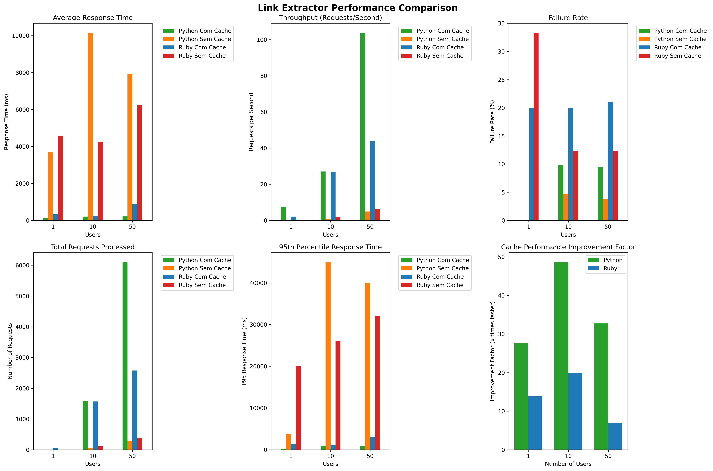

# Teste de Desempenho - Aplicação Link Extractor

Este repositório contém os scripts e resultados dos testes de desempenho realizados na aplicação "Link Extractor", como parte do Trabalho 4.

O objetivo foi comparar o desempenho de duas implementações de API (Python e Ruby), com e sem o uso de cache (Redis), sob diferentes níveis de carga.

## Equipe

- João Pedro Rego Magalhães - Matrícula: 2517985
- João Pedro Monteiro
- José Ricardo Ladislau Colombo 2315044

## Ferramenta de Teste de Carga

Utilizamos o **Locust** como ferramenta de teste de carga. O Locust é uma ferramenta de código aberto que permite simular o comportamento de usuários virtuais acessando uma aplicação. O script de configuração, `locustfile.py`, foi desenvolvido para simular o seguinte comportamento:

- Cada usuário virtual realiza uma sequência de 10 requisições `GET` para a API.
- As URLs testadas são endpoints da aplicação "Link Extractor".
- O tempo de espera entre as requisições varia entre 1 e 2 segundos.

### Configuração do Script

O script `locustfile.py` define a classe `LinkExtractorUser`, que herda de `HttpUser`. Cada usuário virtual executa a tarefa `extract_links_sequence`, que realiza as requisições para os endpoints da API. O tempo de espera entre as requisições é configurado com `wait_time = between(1, 2)`.

## Cenários de Teste Avaliados

Foram avaliados quatro cenários principais:

1. **Python sem Cache**: API desenvolvida em Python, sem uso de Redis.
2. **Python com Cache**: API desenvolvida em Python, utilizando Redis para cache.
3. **Ruby sem Cache**: API desenvolvida em Ruby, sem uso de Redis.
4. **Ruby com Cache**: API desenvolvida em Ruby, utilizando Redis para cache.

Para cada cenário, foram realizados testes com os seguintes níveis de carga:

- 1 Usuário Virtual
- 10 Usuários Virtuais
- 50 Usuários Virtuais

## Resultados

Os resultados dos testes foram coletados em arquivos CSV e analisados para gerar os gráficos abaixo:

### Tempo Médio de Resposta

### Throughput (Requisições por Segundo)

### Taxa de Falha (%)

## Comparação de Desempenho

O gráfico abaixo resume as principais métricas coletadas durante os testes de desempenho:



**Análise:**

- O uso de cache (Redis) reduz significativamente o tempo de resposta e elimina falhas em ambos os ambientes.
- A API em Ruby com cache apresentou o menor tempo médio de resposta e alta estabilidade.
- A API em Python com cache apresentou o maior throughput, destacando-se em cenários de alta carga.

## Como Executar o Projeto

Siga os passos abaixo para replicar o ambiente e executar os testes.

### Pré-requisitos

- Git
- Docker e Docker Compose
- Python 3.x e Pip

### 1. Clonar o Repositório

```bash
git clone https://github.com/Joaomagh/Teste-de-Desempenho-Distribuida.git
cd Teste-de-Desempenho-Distribuida
```

### 2. Instalar Dependências

Instale o Locust, que é a ferramenta de teste utilizada.

```bash
pip install locust
```

### 3. Iniciar o Ambiente da Aplicação

Os serviços da aplicação rodam em contêineres Docker.

```bash
# Navegue até o diretório que contém o docker-compose
cd linkextractor/step6

# Construa e inicie os contêineres em segundo plano
docker-compose up -d --build
```

Para verificar se os três serviços (`api`, `web`, `redis`) estão rodando, use o comando `docker-compose ps`.

### 4. Executar os Testes de Desempenho

Volte para o diretório raiz do projeto e execute o Locust.

```bash
# Voltar para a raiz
cd ../..

# Exemplo de comando para executar o teste
locust -f locustfile.py --host http://localhost:4567 --users 1 --spawn-rate 1 --run-time 1m --headless --csv results/exemplo_teste
```

**Parâmetros do comando:**

- `--host`: A URL da API que será testada.
- `--users`: O número de usuários virtuais a serem simulados.
- `--spawn-rate`: A taxa de novos usuários iniciados por segundo.
- `--run-time`: A duração total do teste (ex: `1m` para 1 minuto).
- `--headless`: Executa o teste sem a interface web do Locust.
- `--csv`: Salva os resultados em arquivos CSV com o prefixo especificado.

## Conclusão

Os testes demonstraram o impacto significativo do uso de cache (Redis) no desempenho das APIs, reduzindo o tempo de resposta e aumentando o throughput. Além disso, foi possível comparar o desempenho entre as implementações em Python e Ruby, destacando as vantagens e desvantagens de cada abordagem.
